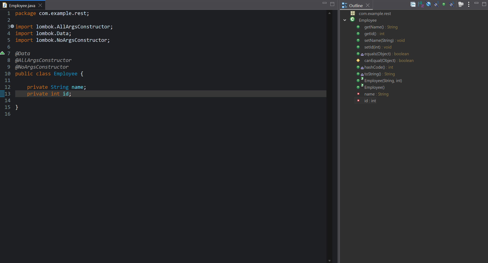
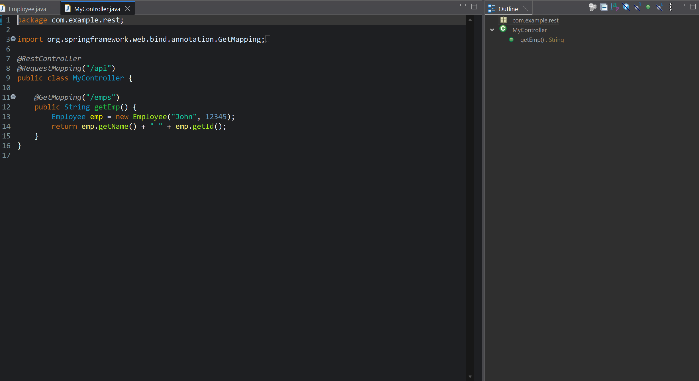

# 06-Lombok - A Bean Management Framework

## Introduction

Welcome to **06 - Lombok - A Bean Management Framework** 

 If you’re new to coding, this is your guide to simplifying Java beans with Lombok! We’ll explore **Lombok**, a framework that eliminates repetitive code (boilerplate) in Plain Old Java Objects (POJOs). We’ll see how it auto-generates getters, setters, constructors, `toString`, `equals`, `hashCode`, and more, making your REST API entities cleaner—building on POJOs from [5.3](#53-java-json-binding-jackson-project) and beyond. Think of this as a magic wand for bean code—let’s dive in! 🚀

---

## Table of Contents

1. [What Is Lombok?](#1-what-is-lombok)
   - [1.1 Lombok: A Bean Helper](#11-lombok-a-bean-helper)
   - [1.2 Why Use Lombok](#12-why-use-lombok)
   - [1.3 Key Terms for Beginners](#13-key-terms-for-beginners)
2. [Learning Roadmap](#2-learning-roadmap)
   - [2.1 Understanding Boilerplate](#21-understanding-boilerplate)
   - [2.2 Setting Up Lombok](#22-setting-up-lombok)
   - [2.3 Using Lombok Annotations](#23-using-lombok-annotations)
3. [Lombok Annotations](#3-lombok-annotations)
4. [Practical Demonstration](#4-practical-demonstration)
   - [4.1 Boilerplate Without Lombok](#41-boilerplate-without-lombok)
   - [4.2 Adding Lombok to a Project](#42-adding-lombok-to-a-project)
   - [4.3 Testing with a REST Controller](#43-testing-with-a-rest-controller)
5. [Practical Application](#5-practical-application)
   - [5.1 Best Practices](#51-best-practices)
   - [5.2 Common Mistakes to Avoid](#52-common-mistakes-to-avoid)
   - [5.3 Hands-On Exercises](#53-hands-on-exercises)
6. [Wrapping Up](#6-wrapping-up)
   - [6.1 Resources for Further Learning](#61-resources-for-further-learning)
   - [6.2 Summary of Key Takeaways](#62-summary-of-key-takeaways)
   - [6.3 What’s Next](#63-whats-next)

---

## 1. What Is Lombok?

### 1.1 Lombok: A Bean Helper

- **Definition**: Lombok is a Java library (framework) that auto-generates boilerplate code for beans (POJOs)—classes with properties like `name` or `id`.
- **What It Does**: Adds getters, setters, constructors (default and parameterized), `toString`, `equals`, `hashCode`, and more—no manual writing needed!
- **Purpose**: Simplifies writing POJOs (entities/classes) with standard bean methods easily.

#### Real-World Analogy

Think of Lombok as a robot assistant—handles the boring paperwork (code) so you focus on the fun stuff!

### 1.2 Why Use Lombok

- **Why**: Cuts out messy, repetitive code—makes POJOs simple, readable, and less "clumsy."
- **Benefit**: In Spring Boot apps, cleaner beans mean less code to maintain—especially for REST APIs (e.g., `Student` from [5.3](#53-java-json-binding-jackson-project)).
- **Dynamic**: Updates methods automatically when properties change—unlike manual or IDE-generated code.

#### Real-World Analogy

Instead of handwriting 60 lines of forms, Lombok stamps them out—saves time and effort!

### 1.3 Key Terms for Beginners

Your newbie glossary:

| Term            | Meaning                                      | Example                   |
|-----------------|----------------------------------------------|---------------------------|
| **POJO**        | Plain Old Java Object—simple class           | `Employee` with `name`, `id` |
| **Boilerplate** | Repetitive code (getters, setters, etc.)    | `getName()`, `setName()`  |
| **Annotation**  | Special tag to trigger features             | `@Data`                   |
| **Bean**        | Same as POJO—data holder                    | `Employee` entity         |
| **Lombok**      | Library to auto-generate bean code          | Adds methods magically    |
| **IDE**         | Integrated Development Environment          | Eclipse                   |

---

## 2. Learning Roadmap

Your path to Lombok mastery!

### 2.1 Understanding Boilerplate

- **What You’ll Learn**: Why boilerplate code is a hassle in POJOs.
- **Goal**: See Lombok’s value in reducing mess.

### 2.2 Setting Up Lombok

- **What You’ll Learn**: How to add Lombok to a Spring Boot project.
- **Goal**: Get it running in Eclipse.

### 2.3 Using Lombok Annotations

- **What You’ll Do**: Use annotations to simplify POJOs.
- **Goal**: Replace 60+ lines of boilerplate with one line.

---

## 3. Lombok Annotations

Here’s a table of all Lombok annotations mentioned in the transcript, with descriptions for readability:

| Annotation              | Description                                                                 | What It Generates                          | Example Usage                       |
|-------------------------|-----------------------------------------------------------------------------|--------------------------------------------|-------------------------------------|
| `@Getter`               | Adds getter methods for all fields                                          | `getName()`, `getId()`                    | `@Getter public class Employee {}`  |
| `@Setter`               | Adds setter methods for all fields                                          | `setName()`, `setId()`                    | `@Setter public class Employee {}`  |
| `@ToString`             | Adds a `toString()` method showing all fields                               | `toString()` → "Employee [name=..., id=...]" | `@ToString public class Employee {}`|
| `@EqualsAndHashCode`    | Adds `equals()` and `hashCode()` methods based on fields                    | `equals()`, `hashCode()`                  | `@EqualsAndHashCode public class Employee {}` |
| `@NoArgsConstructor`    | Adds a default (no-argument) constructor                                    | `Employee()`                              | `@NoArgsConstructor public class Employee {}` |
| `@AllArgsConstructor`   | Adds a constructor with all fields as parameters                            | `Employee(String name, int id)`           | `@AllArgsConstructor public class Employee {}` |
| `@RequiredArgsConstructor` | Adds a constructor for all `final` or `@NonNull` fields                  | `Employee(String name)` (if `name` is final) | `@RequiredArgsConstructor public class Employee {}` |
| `@Data`                 | Shortcut for `@Getter`, `@Setter`, `@ToString`, `@EqualsAndHashCode`, and a required-args constructor | All of the above                          | `@Data public class Employee {}`    |

- **Key Note**: `@Data` is the "one annotation to rule them all"—covers most needs in one go. Add `@NoArgsConstructor` or `@AllArgsConstructor` separately if required.
- **How It Works**: Place on top of the class—Lombok generates the code at compile time, visible in Eclipse’s Outline view.

>[!TIP]
>`@Data` = your go-to for quick, complete POJOs—add extras as needed!

---

## 4. Practical Demonstration

Let’s build a `lombok-demo` app to see Lombok in action!

### 4.1 Boilerplate Without Lombok

- **Example**: `Employee` POJO without Lombok:
  - Create `Employee.java`:
    ```java
    public class Employee {
        private String name;
        private String id;

        // Default constructor
        public Employee() {}

        // Parameterized constructor
        public Employee(String name, String id) {
            this.name = name;
            this.id = id;
        }

        // Getters and Setters
        public String getName() { return name; }
        public void setName(String name) { this.name = name; }
        public String getId() { return id; }
        public void setId(String id) { this.id = id; }

        // toString
        @Override
        public String toString() {
            return "Employee [name=" + name + ", id=" + id + "]";
        }

        // equals and hashCode
        @Override
        public boolean equals(Object o) {
            if (this == o) return true;
            if (o == null || getClass() != o.getClass()) return false;
            Employee employee = (Employee) o;
            return id.equals(employee.id) && name.equals(employee.name);
        }

        @Override
        public int hashCode() {
            return Objects.hash(name, id);
        }
    }
    ```
- **Problem**: ~60 lines for two properties (`name`, `id`)—messy, clumsy, and grows with more fields!
- **IDE Way**: Eclipse (Source > Generate Constructors/Getters/Setters/toString/equals) creates this—still cluttered.

>[!NOTE]
>Boilerplate = code mess—Lombok to the rescue!

### 4.2 Adding Lombok to a Project

- **Goal**: Simplify `Employee` with Lombok.
- **Steps**:
  1. **Create Project**:
     - In Eclipse: `File > New > Spring Starter Project`.
     - Name: `lombok-demo`.
     - Dependencies: `Spring Web` (REST app), `Spring Boot DevTools` (live reload), `Lombok`.
     - Finish—Maven fetches dependencies.
  2. **Check `pom.xml`**:
     - Open `pom.xml`—see:
       ```xml
       <dependency>
           <groupId>org.projectlombok</groupId>
           <artifactId>lombok</artifactId>
           <optional>true</optional>
       </dependency>
       ```
     - Source: `org.projectlombok`—not Spring, a separate library.
  3. **Install Lombok (if needed)**:
     - Go to [projectlombok.org](https://projectlombok.org/).
     - Download `lombok.jar`.
     - Run: `java -jar lombok.jar`—installer detects Eclipse, click `Install/Update`, restart Eclipse.
     - Note: Demo assumes it’s installed—dependency auto-plugs into IDE.
  4. **Update `Employee.java`**:
     - Replace with:
       ```java
       package com.example.lombokdemo;

       import lombok.Data;

       @Data
       public class Employee {
           private String name;
           private int id;
       }
       ```
     - `@Data` adds: getters (`getName()`, `getId()`), setters (`setName()`, `setId()`), `toString`, `equals`, `hashCode`, required-args constructor.
     - Eclipse Outline (right panel): Shows all methods—Lombok generates them dynamically!
  5. **Dynamic Updates**:
     - Change `id` from `String` to `int`—save—Outline updates to `getId()` (returns `int`)—no manual regen needed!

- **Extra Annotations**:
  - Add `@NoArgsConstructor` for default constructor:
    ```java
    @Data
    @NoArgsConstructor
    public class Employee {
        private String name;
        private int id;
    }
    ```
  - `@AllArgsConstructor` (optional here—`@Data` includes it): Explicit all-args constructor.

  ---

### Employee.java



### MyController.java




>[!TIP]
>Lombok keeps it simple and auto-updates—less work, more clarity!

### 4.3 Testing with a REST Controller

- **Goal**: Use Lombok-generated methods in a REST API.
- **Steps**:
  1. **Add Controller**:
     - In `src/main/java/com.example.lombokdemo/LombokDemoApplication.java`, add inside class:
       ```java
       import org.springframework.web.bind.annotation.RestController;
       import org.springframework.web.bind.annotation.RequestMapping;
       import org.springframework.web.bind.annotation.GetMapping;

       @RestController
       @RequestMapping("/api")
       public class LombokDemoApplication {
           // ... main method ...

           @GetMapping("/emps")
           public String getEmployee() {
               Employee emp = new Employee("John", 12345); // Lombok constructor
               return emp.getName() + " " + emp.getId();  // Lombok getters
           }
       }
       ```
     - Creates `/api/emps`—uses Lombok’s constructor and getters.
  2. **Run App**:
     - Right-click `LombokDemoApplication.java` > `Run As > Spring Boot App`.
     - Console: "Tomcat started on port(s): 8080."
  3. **Test**:
     - Browser: `localhost:8080/api/emps` → "John 12345".
     - Postman: `GET localhost:8080/api/emps` → "John 12345", `200 OK`.
- **What’s Happening**:
  - No manual `getName()`, `getId()`, or constructor—Lombok provides them.
  - Could use setters (e.g., `emp.setName("Jane")`)—all available!
  - Dynamic: `id` as `int` auto-adjusts—no code rewrite.

>[!NOTE]
>Lombok + REST = clean POJOs, smooth APIs—coding joy!

---

## 5. Practical Application

Make Lombok yours!

### 5.1 Best Practices

- **Use `@Data`**: Covers most POJO needs—getters, setters, `toString`, etc., in one go.
- **Avoid Manual Code**: Don’t write boilerplate—let Lombok handle it for simplicity.
- **Install Correctly**: Download, run, restart IDE—ensures Lombok plugs in.
- **Verify**: Check Eclipse Outline—confirms methods are there.

### 5.2 Common Mistakes to Avoid

- **Missing Dependency**: No Lombok in `pom.xml`? Add it!
- **Skipped Install**: Didn’t run `lombok.jar`? Methods won’t work—install it!
- **Manual Boilerplate**: Wrote getters anyway? Delete them—Lombok’s got you!
- **Import Error**: `@Data` not recognized? Import `lombok.Data`—hover to fix!

### 5.3 Hands-On Exercises

Try these:

1. **Add Property**:
   - Add `private String role` to `Employee`—update `/api/emps` to include `emp.getRole()`.
2. **Break & Fix**:
   - Remove `@Data`—run app, see error—add it back, test again.
3. **Constructor Test**:
   - Add `@NoArgsConstructor`—use `Employee emp = new Employee(); emp.setName("Jane");`—test output.
4. **ToString Endpoint**:
   - Add `@GetMapping("/emps2")`—return `emp.toString()`—compare to `/emps`.
5. **Outline Check**:
   - View Eclipse Outline—screenshot `getName()`, `setId()`, `toString()`, etc.

>[!TIP]
>Play with Lombok—see how it simplifies your life!

---

## 6. Wrapping Up

### 6.1 Resources for Further Learning

Level up:

- **Lombok**: [projectlombok.org](https://projectlombok.org/) - Official site, download, docs.
- **Spring REST**: [spring.io/guides/gs/rest-service](https://spring.io/guides/gs/rest-service/) - REST guide.
- **Annotations**: [projectlombok.org/features/](https://projectlombok.org/features/) - Full list.
- **Postman**: [learning.postman.com](https://learning.postman.com/) - Testing tool.

### 6.2 Summary of Key Takeaways

- **Lombok**: Bean management framework—eliminates boilerplate (getters, setters, constructors, etc.).
- **Setup**: Add `org.projectlombok:lombok` dependency, install via `lombok.jar`, restart Eclipse.
- **Annotations**: `@Data` for all-in-one; `@NoArgsConstructor`, `@AllArgsConstructor` for extras—clean and simple.
- **Demo**: `lombok-demo`—`Employee` POJO with two fields, used in `/api/emps`—dynamic and mess-free.

>[!TIP]
>Lombok = less typing, more creating—your beans shine!

### 6.3 What’s Next

- **07 - JPA Hibernate**: Connect POJOs to databases—Lombok will keep them tidy!

---