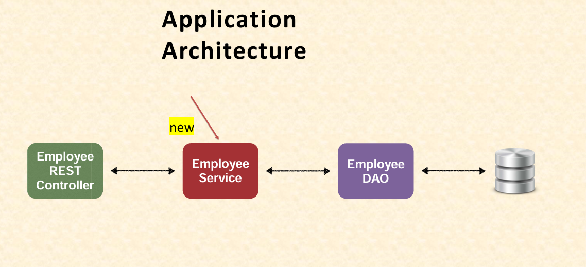

# Mini Project - Employee Management System (EMS)(using JPA API)

## Introduction

Welcome to the **Employee Management System (EMS) Mini Project(using JPA API)**

In this real-time project, we’ll build a REST API with Spring Boot to manage an employee directory, performing CRUD (Create, Read, Update, Delete) operations using JPA and Hibernate(using JPA API). Building on basics from [07](#07-jpa-and-hibernate), we’ll connect to a MySQL database, set up the project, and implement a full application across two parts. Phase 1 covers the database, entity, and DAO, while Phase 2 adds the service layer and REST controller. This is perfect for beginners ready to apply REST and database skills to a practical app! 🚀

---

## Table of Contents

1. [What Is the EMS Project?](#1-what-is-the-ems-project)
   - [1.1 Overview](#11-overview)
   - [1.2 Project Requirements](#12-project-requirements)
   - [1.3 Architecture Overview](#13-architecture-overview)
   - [1.4 Key Terms for Beginners](#14-key-terms-for-beginners)
2. [Learning Roadmap](#2-learning-roadmap)
   - [2.1 Setting Up the Database](#21-setting-up-the-database)
   - [2.2 Creating the Spring Boot Project](#22-creating-the-spring-boot-project)
   - [2.3 Building the Employee Entity](#23-building-the-employee-entity)
   - [2.4 Implementing the DAO](#24-implementing-the-dao)
   - [2.5 Adding the Service Layer](#25-adding-the-service-layer)
   - [2.6 Creating the REST Controller](#26-creating-the-rest-controller)
3. [Practical Demonstration](#3-practical-demonstration)
   - [3.1 Database Setup](#31-database-setup)
   - [3.2 Project Setup](#32-project-setup)
   - [3.3 Employee Entity](#33-employee-entity)
   - [3.4 Employee DAO](#34-employee-dao)
   - [3.5 Employee Service](#35-employee-service)
   - [3.6 Employee REST Controller](#36-employee-rest-controller)
   - [3.7 Testing with Postman](#37-testing-with-postman)
4. [What’s Next](#4-whats-next)

---

## 1. What Is the EMS Project?

### 1.1 Overview

- **Goal**: Create a REST API for an Employee Management System (EMS) to manage employee records using JPA API.
- **How**: Use Spring Boot with JPA/Hibernate to connect to a MySQL database and perform CRUD operations, structured in two parts:
  - **Phase 1**: Database setup, project creation, entity, and DAO.
  - **Phase 2**: Service layer and REST controller.
- **Why**: Apply REST API and database skills to a real-world scenario—manage employee data efficiently with a scalable architecture!

#### Real-World Analogy

Think of this as a digital HR system—add, view, update, or remove employee profiles with a few clicks (or API calls), built step-by-step!

### 1.2 Project Requirements

- **Functionality**: REST clients should:
  - Get a list of all employees (`GET /api/employees`).
  - Get a single employee by ID (`GET /api/employees/{id}`).
  - Add a new employee (`POST /api/employees`).
  - Update an existing employee (`PUT /api/employees`).
  - Delete an employee (`DELETE /api/employees/{id}`).
- **Data**: Employee records include:
  - `id` (auto-incremented primary key).
  - `firstName`.
  - `lastName`.
  - `email`.

### 1.3 Architecture Overview

- **Layers**:
  - **Database**: MySQL (`empdir` database, `employee` table).
  - **DAO**: `EmployeeDAO`—interacts with the database via `EntityManager`.
  - **Service**: `EmployeeService`—business logic layer, delegates to DAO (introduced in Phase 2).
  - **Controller**: REST controller—handles HTTP requests (Phase 2).
- **Flow**: REST Client → Controller → Service → DAO → Database.
- **New Approach**: Unlike [7.4](#74-hibernate-jpa-crud---update--delete), where the controller directly used the DAO, we’ll add a service layer for better separation. This layer integrates data from multiple sources (e.g., multiple DAOs like payroll or skills) and keeps the controller focused on web requests.


_<p align="center">Figure: Application Architecture Employee Management System Project</p>_

> [!NOTE]
> Service layer = middleman—keeps your app organized and scalable for bigger projects!

### 1.4 Key Terms for Beginners

Your newbie glossary:

| Term                 | Meaning                                    | Example                             |
| -------------------- | ------------------------------------------ | ----------------------------------- |
| **EMS**              | Employee Management System                 | This project!                       |
| **REST API**         | Web service for CRUD via HTTP              | GET `/api/employees`                |
| **DAO**              | Data Access Object—handles DB operations   | `EmployeeDAO`                       |
| **Service**          | Business logic layer, delegates to DAO     | `EmployeeService`                   |
| **Lombok**           | Reduces boilerplate code (getters/setters) | `@Data` on `Employee`               |
| **`merge()`**        | Saves or updates an entity                 | `entityManager.merge(employee)`     |
| **`@Service`**       | Marks a service class for Spring scanning  | `@Service` on `EmployeeServiceImpl` |
| **`@Transactional`** | Manages database transactions              | `@Transactional` on `save`          |

---

## 2. Learning Roadmap

Your path to building the complete EMS!

### 2.1 Setting Up the Database

- **What**: Create a MySQL database (`empdir`) and `employee` table with sample data.
- **Goal**: Provide a data foundation for CRUD operations.

### 2.2 Creating the Spring Boot Project

- **What**: Use Spring Initializr to set up the project with required dependencies.
- **Goal**: Establish the app framework.

### 2.3 Building the Employee Entity

- **What**: Define the `Employee` class with JPA annotations and Lombok.
- **Goal**: Map Java to the `employee` table.

### 2.4 Implementing the DAO

- **What**: Create `EmployeeDAO` interface and implementation for CRUD.
- **Goal**: Enable database interaction.

### 2.5 Adding the Service Layer

- **What**: Define `EmployeeService` interface and implementation with `@Service`.
- **Goal**: Add a business logic layer to delegate DAO calls and manage transactions.

### 2.6 Creating the REST Controller

- **What**: Build `EmployeeRestController` with REST endpoints.
- **Goal**: Expose CRUD operations via HTTP.

---

## 3. Practical Demonstration

Let’s build the complete `rest-api-crud-ems` project—covering Phase 1 (database, setup, entity, DAO) and Phase 2 (service, controller, testing)!

### 3.1 Database Setup

- **Purpose**: Create `empdir` database and `employee` table with sample data.
- **Steps** (in MySQL):
  1. Create database:
     ```sql
     CREATE DATABASE empdir;
     USE empdir;
     ```
  2. Create table:
     ```sql
     CREATE TABLE employee (
         id INT NOT NULL AUTO_INCREMENT,
         first_name VARCHAR(255),
         last_name VARCHAR(255),
         email VARCHAR(255),
         PRIMARY KEY (id)
     );
     ```
  3. Insert sample data:
     ```sql
     INSERT INTO employee (first_name, last_name, email) VALUES
         ('Liam', 'Neeson', 'liam@neeson.com'),
         ('Bruce', 'Willis', 'bruce@willis.com'),
         ('Denzel', 'Washington', 'denzel@washington.com');
     ```
- **Verify**:
  - `SHOW TABLES;` → `employee`.
  - `SELECT * FROM employee;` → 3 rows (ids 1-3).
  - `SHOW CREATE TABLE employee;` → Confirms schema.

### 3.2 Project Setup

- **Purpose**: Create `rest-api-crud-ems` with Spring Initializr.
- **Steps**:
  1. Go to [start.spring.io](https://start.spring.io).
  2. Settings:
     - Project: Maven.
     - Group: `com.example`.
     - Artifact: `rest-api-crud-ems`.
  3. Dependencies:
     - **Spring Web**: REST API and Jackson.
     - **Spring Data JPA**: JPA/Hibernate support.
     - **MySQL Driver**: Connect to MySQL.
     - **Spring Boot DevTools**: Live reload.
     - **Lombok**: Cleaner code.
  4. Generate and open in IDE (e.g., Eclipse).
- **POM.xml** (snippet):
  ```xml
  <dependencies>
  		<dependency>
  			<groupId>org.springframework.boot</groupId>
  			<artifactId>spring-boot-starter-data-jpa</artifactId>
  		</dependency>
  		<dependency>
  			<groupId>org.springframework.boot</groupId>
  			<artifactId>spring-boot-starter-web</artifactId>
  		</dependency>
  		<dependency>
  			<groupId>org.springframework.boot</groupId>
  			<artifactId>spring-boot-devtools</artifactId>
  			<scope>runtime</scope>
  			<optional>true</optional>
  		</dependency>
  		<dependency>
  			<groupId>com.mysql</groupId>
  			<artifactId>mysql-connector-j</artifactId>
  			<scope>runtime</scope>
  		</dependency>
  		<dependency>
  			<groupId>org.projectlombok</groupId>
  			<artifactId>lombok</artifactId>
  			<optional>true</optional>
  		</dependency>
  		<dependency>
  			<groupId>org.springframework.boot</groupId>
  			<artifactId>spring-boot-starter-test</artifactId>
  			<scope>test</scope>
  		</dependency>
  	</dependencies>
  ```
- **application.properties**:
  ```properties
  spring.datasource.url=jdbc:mysql://localhost:3306/empdir
  spring.datasource.username=root
  spring.datasource.password=your_password
  ```
- **Notes**:
  - No `spring.jpa.hibernate.ddl-auto`—table created manually (unlike [7.5](#75-jpa-hibernate---creating-tables-from-the-code)).
  - DevTools enables live reload—code changes apply without restarts.

> [!TIP]
> Dependencies = your toolkit—Spring Web for REST, JPA for DB magic!

### 3.3 Employee Entity

- **Purpose**: Define `Employee` to map to the `employee` table.
- **File**: `com.example.jpa.entity.Employee.java`.
- **Code**:

  ```java
  package com.example.jpa.entity;

  import jakarta.persistence.Column;
  import jakarta.persistence.Entity;
  import jakarta.persistence.GeneratedValue;
  import jakarta.persistence.GenerationType;
  import jakarta.persistence.Id;
  import jakarta.persistence.Table;
  import lombok.AllArgsConstructor;
  import lombok.Data;
  import lombok.NoArgsConstructor;

  @Entity
  @Table(name = "employee")
  @Data
  @NoArgsConstructor
  @AllArgsConstructor
  public class Employee {

      @Id
      @GeneratedValue(strategy = GenerationType.IDENTITY)
      @Column(name = "id")
      private int id;

      @Column(name = "first_name")
      private String firstName;

      @Column(name = "last_name")
      private String lastName;

      @Column(name = "email")
      private String email;
  }
  ```

- **Details**:
  - `@Entity` + `@Table`: Maps to `employee` table.
  - `@Id` + `@GeneratedValue`: `id` is auto-incremented primary key.
  - `@Column`: Maps fields (e.g., `firstName` → `first_name`).
  - **Lombok**:
    - `@Data`: Adds getters, setters, `toString`, etc.
    - `@NoArgsConstructor`: Empty constructor.
    - `@AllArgsConstructor`: Constructor with all fields.
    - Reduces boilerplate—keeps code clean!

### 3.4 Employee DAO

- **Purpose**: Define and implement CRUD operations for `Employee`.
- **Interface**: `com.example.jpa.dao.EmployeeDAO.java`.

  ```java
  package com.example.jpa.dao;

  import com.example.jpa.entity.Employee;
  import java.util.List;

  public interface EmployeeDAO {
      List<Employee> findAll();
      Employee findById(int id);
      Employee save(Employee employee);
      void deleteById(int id);
  }
  ```

- **Implementation**: `com.example.jpa.dao.EmployeeDAOImpl.java`.

  ```java
  package com.example.jpa.dao;

  import com.example.jpa.entity.Employee;
  import jakarta.persistence.EntityManager;
  import jakarta.persistence.TypedQuery;
  import org.springframework.beans.factory.annotation.Autowired;
  import org.springframework.stereotype.Repository;
  import java.util.List;

  @Repository
  public class EmployeeDAOImpl implements EmployeeDAO {

      @Autowired
      private EntityManager entityManager;

      @Override
      public List<Employee> findAll() {
          TypedQuery<Employee> query = entityManager.createQuery("FROM Employee", Employee.class);
          return query.getResultList();
      }

      @Override
      public Employee findById(int id) {
          return entityManager.find(Employee.class, id);
      }

      @Override
      public Employee save(Employee employee) {
          return entityManager.merge(employee);
      }

      @Override
      public void deleteById(int id) {
          Employee employee = entityManager.find(Employee.class, id);
          entityManager.remove(employee);
      }
  }
  ```

- **Details**:
  - `@Repository`: Marks as DAO—Spring handles JDBC exceptions.
  - `@Autowired`: Injects `EntityManager` (property injection—alternative: constructor injection).
  - **Methods**:
    - `findAll`: JPQL query (`FROM Employee`) → `List<Employee>`.
    - `findById`: `find()` by `id` → `Employee`.
    - `save`: `merge()` for both add and update:
      - No `id` (or `id=0`): Inserts new record.
      - With `id`: Updates existing record.
      - Returns saved/updated `Employee`.
    - `deleteById`: `find()` then `remove()`—deletes by `id`.
  - No `@Transactional`—moved to service layer (below).

> [!NOTE] >`merge` = save or update—smart and reusable!

### 3.5 Employee Service

- **Purpose**: Add a service layer to delegate DAO calls and manage transactions.
- **Interface**: `com.example.jpa.service.EmployeeService.java`.

  ```java
  package com.example.jpa.service;

  import com.example.jpa.entity.Employee;
  import java.util.List;

  public interface EmployeeService {
      List<Employee> findAll();
      Employee findById(int id);
      Employee save(Employee employee);
      void deleteById(int id);
  }
  ```

- **Implementation**: `com.example.jpa.service.EmployeeServiceImpl.java`.

  ```java
  package com.example.jpa.service;

  import com.example.jpa.dao.EmployeeDAO;
  import com.example.jpa.entity.Employee;
  import org.springframework.beans.factory.annotation.Autowired;
  import org.springframework.stereotype.Service;
  import org.springframework.transaction.annotation.Transactional;
  import java.util.List;

  @Service
  public class EmployeeServiceImpl implements EmployeeService {

      @Autowired
      private EmployeeDAO employeeDAO;

      @Override
      public List<Employee> findAll() {
          return employeeDAO.findAll();
      }

      @Override
      public Employee findById(int id) {
          return employeeDAO.findById(id);
      }

      @Override
      @Transactional
      public Employee save(Employee employee) {
          return employeeDAO.save(employee);
      }

      @Override
      @Transactional
      public void deleteById(int id) {
          employeeDAO.deleteById(id);
      }
  }
  ```

- **Details**:
  - `@Service`: Registers with Spring—enables component scanning, like `@Repository`.
  - `@Autowired`: Injects `EmployeeDAO`.
  - **Methods**: Delegates to DAO:
    - `findAll`: Calls `employeeDAO.findAll()`.
    - `findById`: Calls `employeeDAO.findById(id)`.
    - `save`: Calls `employeeDAO.save(employee)`—handles both add and update.
    - `deleteById`: Calls `employeeDAO.deleteById(id)`.
  - `@Transactional`: Applied to write operations (`save`, `deleteById`)—best practice over DAO-level transactions.
  - **Why Service?**:
    - Separates business logic from controller.
    - Can integrate multiple DAOs (e.g., payroll, skills) in larger apps.
    - Keeps controller simple—handles only web requests.

> [!TIP]
> Service delegates calls—simple yet powerful for scalability!

### 3.6 Employee REST Controller

- **Purpose**: Expose CRUD operations via REST endpoints.
- **File**: `com.example.jpa.controller.EmployeeRestController.java`.
- **Code**:

  ```java
  package com.example.jpa.controller;

  import com.example.jpa.entity.Employee;
  import com.example.jpa.service.EmployeeService;
  import org.springframework.beans.factory.annotation.Autowired;
  import org.springframework.web.bind.annotation.*;
  import java.util.List;

  @RestController
  @RequestMapping("/api")
  public class EmployeeRestController {

      @Autowired
      private EmployeeService employeeService;

      @GetMapping("/employees")
      public List<Employee> getEmployees() {
          return employeeService.findAll();
      }

      @GetMapping("/employees/{employeeId}")
      public Employee getEmployee(@PathVariable int employeeId) {
          Employee employee = employeeService.findById(employeeId);
          if (employee == null) {
              throw new RuntimeException("Employee ID not found: " + employeeId);
          }
          return employee;
      }

      @PostMapping("/employees")
      public Employee addEmployee(@RequestBody Employee employee) {
          // No need to set id=0 explicitly—merge handles it
          return employeeService.save(employee);
      }

      @PutMapping("/employees")
      public Employee updateEmployee(@RequestBody Employee employee) {
          return employeeService.save(employee);
      }

      @DeleteMapping("/employees/{employeeId}")
      public String deleteEmployee(@PathVariable int employeeId) {
          Employee employee = employeeService.findById(employeeId);
          if (employee == null) {
              return "Employee ID not found: " + employeeId;
          }
          employeeService.deleteById(employeeId);
          return "Employee with ID: " + employeeId + " deleted";
      }
  }
  ```

- **Details**:
  - `@RestController` + `@RequestMapping("/api")`: Base endpoint `/api`.
  - `@Autowired`: Injects `EmployeeService` interface—Spring uses `EmployeeServiceImpl` via component scanning.
  - **Endpoints**:
    - `GET /api/employees`: Returns `List<Employee>`—JSON array.
    - `GET /api/employees/{id}`: Returns `Employee` by `id`—JSON object; checks for null.
    - `POST /api/employees`: Adds new `Employee` via `@RequestBody`—no `id` needed, returns saved object.
    - `PUT /api/employees`: Updates `Employee` via `@RequestBody`—requires `id`, returns updated object.
    - `DELETE /api/employees/{id}`: Deletes by `id` via `@PathVariable`—returns message, checks for null.
  - **Add vs. Update**: Same `save()` method:
    - No `id`: Insert (auto-incremented).
    - With `id`: Update existing record.

### 3.7 Testing with Postman

- **Setup**: Run `rest-api-crud-ems` (`Tomcat started on port(s): 8080`).
- **Tests**:
  1. **Get All Employees**:
     - GET `http://localhost:8080/api/employees`.
     - Response: JSON array (e.g., Liam, Bruce, Denzel—ids 1-3).
  2. **Get Single Employee**:
     - GET `http://localhost:8080/api/employees/1`.
     - Response: `{"id": 1, "firstName": "Liam", "lastName": "Neeson", "email": "liam@neeson.com"}`.
     - Invalid ID (e.g., `/9`): Exception (enhance with [5.4](#54-exception-handling) later).
  3. **Add Employee**:
     - POST `http://localhost:8080/api/employees`.
     - Body (`Raw` > `JSON`):
       ```json
       {
         "firstName": "Angelina",
         "lastName": "Jolie",
         "email": "angelina@jolie.com"
       }
       ```
     - Response: `{"id": 6, "firstName": "Angelina", ...}` (ID may vary due to prior deletes).
     - Add another:
       ```json
       {
         "firstName": "Nicolas",
         "lastName": "Cage",
         "email": "nicolas@cage.com"
       }
       ```
     - Response: `{"id": 7, ...}`.
  4. **Update Employee**:
     - PUT `http://localhost:8080/api/employees`.
     - Body:
       ```json
       {
         "id": 7,
         "firstName": "Nicolas",
         "lastName": "Cage",
         "email": "nicolas@cage.net"
       }
       ```
     - Response: Updated object—email now `.net`.
  5. **Delete Employee**:
     - DELETE `http://localhost:8080/api/employees/7`.
     - Response: `"Employee with ID: 7 deleted"`.
     - Invalid ID (e.g., `/9`): `"Employee ID not found: 9"`.
  6. **Verify**:
     - GET `/api/employees` → 4 employees (ids 1-3, 6—no 7).
     - MySQL: `SELECT * FROM employee;` → Matches.

> [!NOTE]
> From DB to REST—full CRUD in action with service layer magic!

---

## 4. What’s Next

- **Next Sessions**:
  - Refactor EMS with **Spring Data JPA**—use repositories for simpler DAO.
  - Enhance with **Spring Data REST**—auto-generate REST endpoints.
- **Upcoming**: Add exception handling or security (e.g., [08-Security](#08-spring-boot-and-security)).
- **Why**: Understand this JPA version first—then see Spring’s magic minimize code!

> [!TIP]
> EMS complete—next, simplify it with Spring Data!

---
