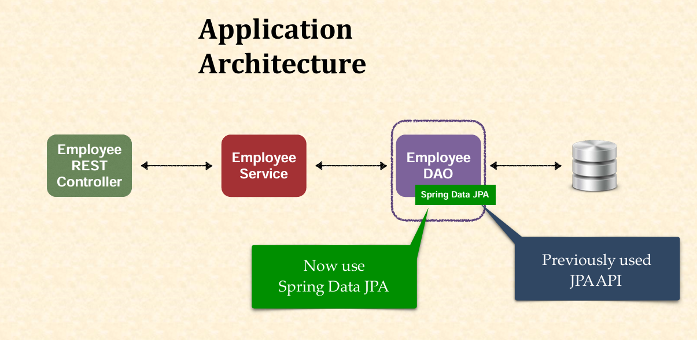

 Mini Project - Employee Management System (EMS) (using Spring Data JPA)

## Introduction

Welcome to the **Employee Management System (EMS) Mini Project (using Spring Data JPA)**

 In this real-time project, we’ll enhance our REST API for managing an employee directory, performing CRUD (Create, Read, Update, Delete) operations with Spring Boot and Spring Data JPA. Building on the JPA API version from "Mini Project - Employee Management System (using JPA API)," we’ll connect to a MySQL database and simplify our data access layer, slashing boilerplate code by 70%! This is perfect for beginners eager to see Spring’s magic in action! 🚀

---

## Table of Contents

1. [What Is the EMS Project with Spring Data JPA?](#1-what-is-the-ems-project-with-spring-data-jpa)
   - [1.1 Overview](#11-overview)
   - [1.2 Project Requirements](#12-project-requirements)
   - [1.3 Architecture Overview](#13-architecture-overview)
   - [1.4 Key Terms for Beginners](#14-key-terms-for-beginners)
2. [Learning Roadmap](#2-learning-roadmap)
   - [2.1 Reviewing the JPA API Version](#21-reviewing-the-jpa-api-version)
   - [2.2 Setting Up Spring Data JPA](#22-setting-up-spring-data-jpa)
   - [2.3 Replacing DAO with Repository](#23-replacing-dao-with-repository)
   - [2.4 Updating the Service Layer](#24-updating-the-service-layer)
   - [2.5 Keeping Entity and Controller](#25-keeping-entity-and-controller)
   - [2.6 Testing the Application](#26-testing-the-application)
3. [Practical Demonstration](#3-practical-demonstration)
   - [3.1 Database Setup](#31-database-setup)
   - [3.2 Project Setup](#32-project-setup)
   - [3.3 Employee Entity](#33-employee-entity)
   - [3.4 Employee Repository](#34-employee-repository)
   - [3.5 Employee Service](#35-employee-service)
   - [3.6 Employee REST Controller](#36-employee-rest-controller)
   - [3.7 Testing with Postman](#37-testing-with-postman)
4. [What’s Next](#4-whats-next)

---

## 1. What Is the EMS Project with Spring Data JPA?

### 1.1 Overview

- **Goal**: Enhance the EMS REST API to manage employee records using Spring Data JPA instead of JPA API.
- **How**: Replace manual DAO code with Spring Data JPA’s `JpaRepository`, minimizing code while retaining full CRUD functionality.
- **Why**: Streamline development—reduce boilerplate, leverage Spring’s magic, and maintain the same features from the JPA API version!

#### Real-World Analogy

Think of this as upgrading from handcrafting furniture (JPA API) to using a pre-built kit (Spring Data JPA)—same result, less effort!

### 1.2 Project Requirements

- **Functionality**: REST clients should:
  - Get a list of all employees (`GET /api/employees`).
  - Get a single employee by ID (`GET /api/employees/{id}`).
  - Add a new employee (`POST /api/employees`).
  - Update an existing employee (`PUT /api/employees`).
  - Delete an employee (`DELETE /api/employees/{id}`).
- **Data**: Employee records include:
  - `id` (auto-incremented primary key).
  - `firstName`.
  - `lastName`.
  - `email`.

### 1.3 Architecture Overview

- **Layers**:
  - **Database**: MySQL (`empdir` database, `employee` table).
  - **Repository**: `EmployeeRepository`—replaces DAO, extends `JpaRepository` for free CRUD methods.
  - **Service**: `EmployeeService`—business logic, delegates to repository.
  - **Controller**: REST controller—handles HTTP requests.
- **Flow**: REST Client → Controller → Service → Repository → Database.
- **Change from JPA API**: Eliminates `EmployeeDAO` and its implementation—`JpaRepository` provides CRUD logic automatically, reducing code by ~70%.


_<p align="center">Figure: Application Architecture with Spring Data JPA</p>_

>[!NOTE]
>`JpaRepository` = Spring’s magic wand—CRUD without the grind!

### 1.4 Key Terms for Beginners

Your newbie glossary:

| Term             | Meaning                                      | Example                       |
|------------------|----------------------------------------------|-------------------------------|
| **EMS**          | Employee Management System                   | This project!                 |
| **REST API**     | Web service for CRUD via HTTP                | GET `/api/employees`          |
| **Repository**   | Interface replacing DAO—extends `JpaRepository` | `EmployeeRepository`       |
| **Spring Data JPA** | Framework for simplified data access       | `extends JpaRepository`       |
| **Lombok**       | Reduces boilerplate code (getters/setters)   | `@Data` on `Employee`         |
| **`Optional`**   | Java 8 class to handle null values           | `Optional<Employee>`          |
| **`@Transactional`** | Manages database transactions            | `@Transactional` on `save`    |

---

## 2. Learning Roadmap

Your path to building EMS with Spring Data JPA!

### 2.1 Reviewing the JPA API Version

- **What**: Understand the previous EMS project with manual DAO code.
- **Goal**: Recognize the boilerplate we’ll eliminate.

### 2.2 Setting Up Spring Data JPA

- **What**: Add Spring Data JPA dependency (already included via `spring-boot-starter-data-jpa`).
- **Goal**: Enable `JpaRepository` support.

### 2.3 Replacing DAO with Repository

- **What**: Create `EmployeeRepository` extending `JpaRepository`.
- **Goal**: Get CRUD methods for free—no implementation needed.

### 2.4 Updating the Service Layer

- **What**: Modify `EmployeeService` to use `EmployeeRepository` instead of `EmployeeDAO`.
- **Goal**: Delegate calls to repository methods.

### 2.5 Keeping Entity and Controller

- **What**: Retain `Employee` entity and `EmployeeRestController` with minor tweaks.
- **Goal**: Maintain core functionality with less code.

### 2.6 Testing the Application

- **What**: Verify CRUD operations via Postman.
- **Goal**: Confirm the app works as before with reduced code.

---

## 3. Practical Demonstration

Let’s build `rest-api-spring-data-jpa-ems` by refactoring `rest-api-crud-ems` to use Spring Data JPA!

### 3.1 Database Setup

- **Purpose**: Use the same `empdir` database and `employee` table.
- **Steps** (in MySQL):
  1. Create database (if not already done):
     ```sql
     CREATE DATABASE empdir;
     USE empdir;
     ```
  2. Create table:
     ```sql
     CREATE TABLE employee (
         id INT NOT NULL AUTO_INCREMENT,
         first_name VARCHAR(255),
         last_name VARCHAR(255),
         email VARCHAR(255),
         PRIMARY KEY (id)
     );
     ```
  3. Insert sample data:
     ```sql
     INSERT INTO employee (first_name, last_name, email) VALUES
         ('Liam', 'Neeson', 'liam@neeson.com'),
         ('Bruce', 'Willis', 'bruce@willis.com'),
         ('Denzel', 'Washington', 'denzel@washington.com'),
         ('Angelina', 'Jolie', 'angelina@jolie.com');
     ```
- **Verify**:
  - `SHOW TABLES;` → `employee`.
  - `SELECT * FROM employee;` → 4 rows (ids 1-4 or higher).

### 3.2 Project Setup

- **Purpose**: Set up `rest-api-spring-data-jpa-ems` (copy from `rest-api-crud-ems`).
- **Steps**:
  1. Copy the previous project or use Spring Initializr:
     - Group: `com.example`.
     - Artifact: `rest-api-spring-data-jpa-ems`.
  2. Dependencies (same as before—Spring Data JPA is included):
     - Spring Web.
     - Spring Data JPA.
     - MySQL Driver.
     - Spring Boot DevTools.
     - Lombok.
- **POM.xml** (snippet):
  ```xml
  <dependencies>
      <dependency>
          <groupId>org.springframework.boot</groupId>
          <artifactId>spring-boot-starter-data-jpa</artifactId>
      </dependency>
      <dependency>
          <groupId>org.springframework.boot</groupId>
          <artifactId>spring-boot-starter-web</artifactId>
      </dependency>
      <dependency>
          <groupId>org.springframework.boot</groupId>
          <artifactId>spring-boot-devtools</artifactId>
          <scope>runtime</scope>
      </dependency>
      <dependency>
          <groupId>com.mysql</groupId>
          <artifactId>mysql-connector-j</artifactId>
          <scope>runtime</scope>
      </dependency>
      <dependency>
          <groupId>org.projectlombok</groupId>
          <artifactId>lombok</artifactId>
          <optional>true</optional>
      </dependency>
  </dependencies>
  ```
- **application.properties**:
  ```properties
  spring.datasource.url=jdbc:mysql://localhost:3306/empdir
  spring.datasource.username=root
  spring.datasource.password=your_password
  ```
- **Notes**:
  - No `ddl-auto`—table is manual.
  - Spring Data JPA is active via `spring-boot-starter-data-jpa`.

>[!TIP]
>`spring-boot-starter-data-jpa` = your key to Spring magic!

### 3.3 Employee Entity

- **Purpose**: Reuse the `Employee` entity—unchanged from JPA API version.
- **File**: `com.example.jpa.entity.Employee.java`.
- **Code**:
  ```java
  package com.example.jpa.entity;

  import jakarta.persistence.Column;
  import jakarta.persistence.Entity;
  import jakarta.persistence.GeneratedValue;
  import jakarta.persistence.GenerationType;
  import jakarta.persistence.Id;
  import jakarta.persistence.Table;
  import lombok.AllArgsConstructor;
  import lombok.Data;
  import lombok.NoArgsConstructor;

  @Entity
  @Table(name = "employee")
  @Data
  @NoArgsConstructor
  @AllArgsConstructor
  public class Employee {

      @Id
      @GeneratedValue(strategy = GenerationType.IDENTITY)
      @Column(name = "id")
      private int id;

      @Column(name = "first_name")
      private String firstName;

      @Column(name = "last_name")
      private String lastName;

      @Column(name = "email")
      private String email;
  }
  ```

### 3.4 Employee Repository

- **Purpose**: Replace DAO with a repository extending `JpaRepository`.
- **File**: `com.example.jpa.repository.EmployeeRepository.java`.
- **Code**:
  ```java
  package com.example.jpa.repository;

  import com.example.jpa.entity.Employee;
  import org.springframework.data.jpa.repository.JpaRepository;

  public interface EmployeeRepository extends JpaRepository<Employee, Integer> {
  }
  ```
- **Details**:
  - `@Repository` not needed—`JpaRepository` handles it.
  - `Employee`: Entity type.
  - `Integer`: Primary key type (`id`).
  - **Free Methods**: `findAll()`, `findById()`, `save()`, `deleteById()`, and more—no implementation required!
  - Replaces `EmployeeDAO` and `EmployeeDAOImpl`—cuts ~30+ lines of code.

>[!NOTE]
>One line = full CRUD—Spring Data JPA’s power!

### 3.5 Employee Service

- **Purpose**: Update service to use `EmployeeRepository`.
- **Interface**: `com.example.jpa.service.EmployeeService.java`.
  ```java
  package com.example.jpa.service;

  import com.example.jpa.entity.Employee;
  import java.util.List;
  import java.util.Optional;

  public interface EmployeeService {
      List<Employee> findAll();
      Optional<Employee> findById(int id);
      Employee save(Employee employee);
      void deleteById(int id);
  }
  ```
- **Implementation**: `com.example.jpa.service.EmployeeServiceImpl.java`.
  ```java
  package com.example.jpa.service;

  import com.example.jpa.entity.Employee;
  import com.example.jpa.repository.EmployeeRepository;
  import org.springframework.beans.factory.annotation.Autowired;
  import org.springframework.stereotype.Service;
  import org.springframework.transaction.annotation.Transactional;
  import java.util.List;
  import java.util.Optional;

  @Service
  public class EmployeeServiceImpl implements EmployeeService {

      @Autowired
      private EmployeeRepository employeeRepository;

      @Override
      public List<Employee> findAll() {
          return employeeRepository.findAll();
      }

      @Override
      public Optional<Employee> findById(int id) {
          return employeeRepository.findById(id);
      }

      @Override
      @Transactional
      public Employee save(Employee employee) {
          return employeeRepository.save(employee);
      }

      @Override
      @Transactional
      public void deleteById(int id) {
          employeeRepository.deleteById(id);
      }
  }
  ```
- **Details**:
  - `@Autowired`: Injects `EmployeeRepository` instead of `EmployeeDAO`.
  - **Changes**:
    - `findById`: Returns `Optional<Employee>`—matches `JpaRepository`’s method, handles nulls (Java 8 feature).
    - Calls: `employeeRepository.findAll()`, `.findById()`, `.save()`, `.deleteById()`—all free methods.
  - `@Transactional`: Still on write operations (`save`, `deleteById`).

### 3.6 Employee REST Controller

- **Purpose**: Adjust controller for `Optional` return type.
- **File**: `com.example.jpa.controller.EmployeeRestController.java`.
- **Code**:
  ```java
  package com.example.jpa.controller;

  import com.example.jpa.entity.Employee;
  import com.example.jpa.service.EmployeeService;
  import org.springframework.beans.factory.annotation.Autowired;
  import org.springframework.web.bind.annotation.*;
  import java.util.List;
  import java.util.Optional;

  @RestController
  @RequestMapping("/api")
  public class EmployeeRestController {

      @Autowired
      private EmployeeService employeeService;

      @GetMapping("/employees")
      public List<Employee> getEmployees() {
          return employeeService.findAll();
      }

      @GetMapping("/employees/{employeeId}")
      public Employee getEmployee(@PathVariable int employeeId) {
          Optional<Employee> employee = employeeService.findById(employeeId);
          if (employee.isEmpty()) {
              throw new RuntimeException("Employee ID not found: " + employeeId);
          }
          return employee.get();
      }

      @PostMapping("/employees")
      public Employee addEmployee(@RequestBody Employee employee) {
          return employeeService.save(employee);
      }

      @PutMapping("/employees")
      public Employee updateEmployee(@RequestBody Employee employee) {
          return employeeService.save(employee);
      }

      @DeleteMapping("/employees/{employeeId}")
      public String deleteEmployee(@PathVariable int employeeId) {
          Optional<Employee> employee = employeeService.findById(employeeId);
          if (employee.isEmpty()) {
              return "Employee ID not found: " + employeeId;
          }
          employeeService.deleteById(employeeId);
          return "Employee with ID: " + employeeId + " deleted";
      }
  }
  ```
- **Details**:
  - **Changes**:
    - `getEmployee` and `deleteEmployee`: Use `Optional<Employee>`—check `.isEmpty()` instead of `null`.
    - `.get()` unwraps `Optional` to return `Employee`.
  - Rest unchanged—endpoints and logic identical.

### 3.7 Testing with Postman

- **Setup**: Run `rest-api-spring-data-jpa-ems` (`Tomcat started on port(s): 8080`).
- **Tests**:
  1. **Get All Employees**:
     - GET `http://localhost:8080/api/employees`.
     - Response: JSON array (e.g., 4 employees—ids 1-4 or higher).
  2. **Get Single Employee**:
     - GET `http://localhost:8080/api/employees/6`.
     - Response: `{"id": 6, "firstName": "Angelina", "lastName": "Jolie", "email": "angelina@jolie.com"}`.
     - Invalid ID (e.g., `/9`): Exception (enhance later).
  3. **Add Employee**:
     - POST `http://localhost:8080/api/employees`.
     - Body (`Raw` > `JSON`):
       ```json
       {
           "firstName": "Nicolas",
           "lastName": "Cage",
           "email": "nicolas@cage.net"
       }
       ```
     - Response: `{"id": 8, ...}` (ID varies).
  4. **Update Employee**:
     - PUT `http://localhost:8080/api/employees`.
     - Body:
       ```json
       {
           "id": 8,
           "firstName": "Nicolas",
           "lastName": "Cage",
           "email": "nicolas@cage.com"
       }
       ```
     - Response: Updated object—email now `.com`.
  5. **Delete Employee**:
     - DELETE `http://localhost:8080/api/employees/8`.
     - Response: `"Employee with ID: 8 deleted"`.
     - Invalid ID (e.g., `/9`): `"Employee ID not found: 9"`.
  6. **Verify**:
     - GET `/api/employees` → Updated list.
     - MySQL: `SELECT * FROM employee;` → Matches.

>[!TIP]
>Same results, less code—Spring Data JPA FTW!

---

## 4. What’s Next

- **Next Session**: **Spring Data REST**—reduce code further (up to 90%) by auto-generating REST endpoints.


>[!NOTE]
>From 30+ lines to 1—next, cut even more with Spring Data REST!

---
