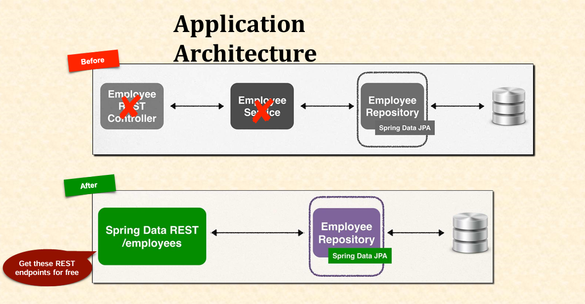

# Mini Project - Employee Management System (EMS) (using Spring Data REST)

## Introduction

Welcome to the **Employee Management System (EMS) Mini Project (using Spring Data REST)**

In this real-time project, we’ll supercharge our REST API for managing an employee directory, performing CRUD (Create, Read, Update, Delete) operations with Spring Boot and Spring Data REST. Building on the Spring Data JPA version, we’ll connect to a MySQL database and slash boilerplate code by 85-90%, auto-generating REST endpoints for free! This is an exciting step for beginners to witness Spring’s ultimate magic! 🚀

We’ll also briefly explore a Student Management System (SMS) to show how reusable this approach is.

---

## Table of Contents

1. [What Is the EMS Project with Spring Data REST?](#1-what-is-the-ems-project-with-spring-data-rest)
   - [1.1 Overview](#11-overview)
   - [1.2 Project Requirements](#12-project-requirements)
   - [1.3 Architecture Overview](#13-architecture-overview)
   - [1.4 Key Terms for Beginners](#14-key-terms-for-beginners)
2. [Learning Roadmap](#2-learning-roadmap)
   - [2.1 Reviewing the Spring Data JPA Version](#21-reviewing-the-spring-data-jpa-version)
   - [2.2 Setting Up Spring Data REST](#22-setting-up-spring-data-rest)
   - [2.3 Keeping Entity and Repository](#23-keeping-entity-and-repository)
   - [2.4 Removing Service and Controller](#24-removing-service-and-controller)
   - [2.5 Understanding Auto-Generated Endpoints](#25-understanding-auto-generated-endpoints)
   - [2.6 Testing the Application](#26-testing-the-application)
3. [Practical Demonstration](#3-practical-demonstration)
   - [3.1 Database Setup](#31-database-setup)
   - [3.2 Project Setup](#32-project-setup)
   - [3.3 Employee Entity](#33-employee-entity)
   - [3.4 Employee Repository](#34-employee-repository)
   - [3.5 Testing EMS with Postman](#35-testing-ems-with-postman)
   - [3.6 Bonus: Student Management System (SMS)](#36-bonus-student-management-system-sms)
4. [What’s Next](#4-whats-next)

---

## 1. What Is the EMS Project with Spring Data REST?

### 1.1 Overview

- **Goal**: Enhance the EMS REST API using Spring Data REST to auto-generate endpoints for employee CRUD operations.
- **How**: Add the Spring Data REST dependency, leverage existing `JpaRepository`, and let Spring handle the REST layer—no manual controller or service needed!
- **Why**: Minimize code drastically (85-90% reduction from the original JPA API version) while keeping full functionality—pure Spring magic!

#### Real-World Analogy

Imagine ordering a fully cooked meal (Spring Data REST) instead of cooking from scratch (JPA API) or assembling ingredients (Spring Data JPA)—same taste, zero effort!

### 1.2 Project Requirements

- **Functionality**: REST clients should:
  - Get all employees (`GET /employees`).
  - Get an employee by ID (`GET /employees/{id}`).
  - Add a new employee (`POST /employees`).
  - Update an employee (`PUT /employees/{id}`).
  - Delete an employee (`DELETE /employees/{id}`).
- **Data**: Employee records include:
  - `id` (auto-incremented primary key).
  - `firstName`.
  - `lastName`.
  - `email`.

### 1.3 Architecture Overview

- **Layers**:
  - **Database**: MySQL (`empdir` database, `employee` table).
  - **Repository**: `EmployeeRepository`—extends `JpaRepository`, scanned by Spring Data REST.
  - **Spring Data REST**: Auto-generates REST endpoints—no service or controller!
- **Flow**: REST Client → Spring Data REST → Repository → Database.
- **Change from Spring Data JPA**: Eliminates `EmployeeService` and `EmployeeRestController`—Spring Data REST scans `JpaRepository` and exposes endpoints based on the entity (`Employee` → `/employees`).


_<p align="center">Figure: Application Architecture with Spring Data REST</p>_

> [!NOTE]
> Spring Data REST = endpoints for free—controller and service obsolete!

### 1.4 Key Terms for Beginners

Your newbie glossary:

| Term                 | Meaning                                    | Example                      |
| -------------------- | ------------------------------------------ | ---------------------------- |
| **EMS**              | Employee Management System                 | This project!                |
| **Spring Data REST** | Auto-generates REST APIs from repositories | `/employees` endpoint        |
| **Repository**       | Interface extending `JpaRepository`        | `EmployeeRepository`         |
| **HATEOAS**          | Hypermedia format for REST responses       | Links in `/employees` output |
| **Lombok**           | Reduces boilerplate code (getters/setters) | `@Data` on `Employee`        |

---

## 2. Learning Roadmap

Your path to building EMS with Spring Data REST!

### 2.1 Reviewing the Spring Data JPA Version

- **What**: Recap the EMS project with `EmployeeRepository`, `EmployeeService`, and `EmployeeRestController`.
- **Goal**: Understand what we’re simplifying.

### 2.2 Setting Up Spring Data REST

- **What**: Add `spring-boot-starter-data-rest` dependency to `pom.xml`.
- **Goal**: Enable auto-generation of REST endpoints.

### 2.3 Keeping Entity and Repository

- **What**: Retain `Employee` entity and `EmployeeRepository`.
- **Goal**: Provide the foundation for Spring Data REST to work.

### 2.4 Removing Service and Controller

- **What**: Delete `EmployeeService` and `EmployeeRestController`.
- **Goal**: Let Spring Data REST handle everything.

### 2.5 Understanding Auto-Generated Endpoints

- **What**: Learn how `/employees` and `/employees/{id}` are created from the `Employee` entity.
- **Goal**: Master Spring Data REST’s naming convention.

### 2.6 Testing the Application

- **What**: Verify CRUD operations via Postman or browser.
- **Goal**: Confirm functionality with minimal code.

---

## 3. Practical Demonstration

Let’s build `rest-api-spring-data-rest-ems` by refactoring `rest-api-spring-data-jpa-ems`!

### 3.1 Database Setup

- **Purpose**: Use the same `empdir` database and `employee` table.
- **Steps** (in MySQL):
  1. Create database (if not already done):
     ```sql
     CREATE DATABASE empdir;
     USE empdir;
     ```
  2. Create table:
     ```sql
     CREATE TABLE employee (
         id INT NOT NULL AUTO_INCREMENT,
         first_name VARCHAR(255),
         last_name VARCHAR(255),
         email VARCHAR(255),
         PRIMARY KEY (id)
     );
     ```
  3. Insert sample data:
     ```sql
     INSERT INTO employee (first_name, last_name, email) VALUES
         ('Liam', 'Neeson', 'liam@neeson.com'),
         ('Bruce', 'Willis', 'bruce@willis.com'),
         ('Denzel', 'Washington', 'denzel@washington.com'),
         ('Angelina', 'Jolie', 'angelina@jolie.com');
     ```
- **Verify**:
  - `SELECT * FROM employee;` → 4 rows.

### 3.2 Project Setup

- **Purpose**: Set up `rest-api-spring-data-rest-ems`.
- **Steps**:

  1. Copy `rest-api-spring-data-jpa-ems` or use Spring Initializr:
     - Group: `com.example`.
     - Artifact: `rest-api-spring-data-rest-ems`.
  2. Dependencies:
     - Spring Data JPA (includes `JpaRepository`).
     - Spring Data REST (new addition).
     - MySQL Driver.
     - Lombok.
  3. Update `pom.xml`:

     ```xml
     <dependencies>
     <dependency>
     		<groupId>org.springframework.boot</groupId>
     		<artifactId>spring-boot-starter-data-jpa</artifactId>
     	</dependency>

     	<dependency>
     		<groupId>org.springframework.boot</groupId>
     		<artifactId>spring-boot-starter-web</artifactId>
     	</dependency>

     	<dependency>
     		<groupId>org.springframework.boot</groupId>
     		<artifactId>spring-boot-devtools</artifactId>
     		<scope>runtime</scope>
     		<optional>true</optional>
     	</dependency>

     	<dependency>
     		<groupId>com.mysql</groupId>
     		<artifactId>mysql-connector-j</artifactId>
     		<scope>runtime</scope>
     	</dependency>

     	<dependency>
     		<groupId>org.projectlombok</groupId>
     		<artifactId>lombok</artifactId>
     		<optional>true</optional>
     	</dependency>

     	<dependency>
     		<groupId>org.springframework.boot</groupId>
     		<artifactId>spring-boot-starter-test</artifactId>
     		<scope>test</scope>
     	</dependency>

     	<dependency>
     		<groupId>org.springframework.boot</groupId>
     		<artifactId>spring-boot-starter-data-rest</artifactId>
     	</dependency>
     </dependencies>
     ```

  4. Update Maven (e.g., in Eclipse: right-click project → Maven → Update Project).

- **application.properties**:
  ```properties
  spring.datasource.url=jdbc:mysql://localhost:3306/empdir
  spring.datasource.username=root
  spring.datasource.password=your_password
  ```

> [!TIP] >`spring-boot-starter-data-rest` = your REST API genie!

### 3.3 Employee Entity

- **Purpose**: Reuse the `Employee` entity—unchanged.
- **File**: `com.example.jpa.entity.Employee.java`.
- **Code**:

  ```java
  package com.example.jpa.entity;

  import jakarta.persistence.Column;
  import jakarta.persistence.Entity;
  import jakarta.persistence.GeneratedValue;
  import jakarta.persistence.GenerationType;
  import jakarta.persistence.Id;
  import jakarta.persistence.Table;
  import lombok.AllArgsConstructor;
  import lombok.Data;
  import lombok.NoArgsConstructor;

  @Entity
  @Table(name = "employee")
  @Data
  @NoArgsConstructor
  @AllArgsConstructor
  public class Employee {

      @Id
      @GeneratedValue(strategy = GenerationType.IDENTITY)
      @Column(name = "id")
      private int id;

      @Column(name = "first_name")
      private String firstName;

      @Column(name = "last_name")
      private String lastName;

      @Column(name = "email")
      private String email;
  }
  ```

### 3.4 Employee Repository

- **Purpose**: Reuse `EmployeeRepository`—Spring Data REST scans it.
- **File**: `com.example.jpa.repository.EmployeeRepository.java`.
- **Code**:

  ```java
  package com.example.jpa.repository;

  import com.example.jpa.entity.Employee;
  import org.springframework.data.jpa.repository.JpaRepository;

  public interface EmployeeRepository extends JpaRepository<Employee, Integer> {
  }
  ```

- **Details**:
  - Spring Data REST scans this, sees `Employee`, and generates `/employees` endpoints.
  - No changes needed—same as Spring Data JPA version.

> [!NOTE]
> Repository + dependency = instant REST API!

### 3.5 Testing EMS with Postman

- **Setup**: Run `rest-api-spring-data-rest-ems` (`Tomcat started on port(s): 8080`).
- **Endpoints**: Auto-generated as `/employees` (pluralized, lowercase entity name).
- **Tests**:
  1. **Get All Employees**:
     - GET `http://localhost:8080/employees`.
     - Response (HATEOAS format):
       ```json
       {
         "_embedded": {
           "employees": [
             {"id": 1, "firstName": "Liam", "lastName": "Neeson", "email": "liam@neeson.com", "_links": {...}},
             {"id": 2, "firstName": "Bruce", "lastName": "Willis", "email": "bruce@willis.com", "_links": {...}},
             {"id": 3, "firstName": "Denzel", "lastName": "Washington", "email": "denzel@washington.com", "_links": {...}},
             {"id": 4, "firstName": "Angelina", "lastName": "Jolie", "email": "angelina@jolie.com", "_links": {...}}
           ]
         },
         "_links": {...},
         "page": {"size": 20, "totalElements": 4, "totalPages": 1, "number": 0}
       }
       ```
  2. **Get Single Employee**:
     - GET `http://localhost:8080/employees/1`.
     - Response:
       ```json
       {"id": 1, "firstName": "Liam", "lastName": "Neeson", "email": "liam@neeson.com", "_links": {...}}
       ```
  3. **Add Employee**:
     - POST `http://localhost:8080/employees`.
     - Body (`Raw` > `JSON`):
       ```json
       {
         "firstName": "Nicolas",
         "lastName": "Cage",
         "email": "nicolas@cage.net"
       }
       ```
     - Response: `{"id": 10, ...}` (ID varies).
  4. **Update Employee**:
     - PUT `http://localhost:8080/employees/10`.
     - Body:
       ```json
       {
         "firstName": "Nicolas",
         "lastName": "Cage",
         "email": "nicolas@cage.com"
       }
       ```
     - Response: Updated object—email now `.com`.
  5. **Delete Employee**:
     - DELETE `http://localhost:8080/employees/10`.
     - Response: 204 No Content (success).
  6. **Verify**:
     - GET `/employees` → 4 employees again.
     - MySQL: `SELECT * FROM employee;` → Matches.

> [!TIP]
> HATEOAS adds links—explore them in the browser!

### 3.6 Bonus: Student Management System (SMS)

- **Purpose**: Show Spring Data REST’s reusability with a `Student` entity.
- **Setup**:

  1. Copy `hibernate-demo-crud-app` or create `hibernate-demo-data-rest`.
  2. Add dependency to `pom.xml`:
     ```xml
     <dependency>
         <groupId>org.springframework.boot</groupId>
         <artifactId>spring-boot-starter-data-rest</artifactId>
     </dependency>
     ```
  3. Database (`student_db`):
     ```sql
     CREATE DATABASE student_db;
     USE student_db;
     CREATE TABLE student (
         id INT NOT NULL AUTO_INCREMENT,
         first_name VARCHAR(45),
         last_name VARCHAR(45),
         email VARCHAR(45),
         PRIMARY KEY (id)
     );
     INSERT INTO student (first_name, last_name, email) VALUES
         ('John', 'Doe', 'john.doe@example.com'),
         ('Jane', 'Smith', 'jane.smith@example.com'),
         ('Bob', 'Johnson', 'bob.johnson@example.com');
     ```
  4. `application.properties`:
     ```properties
     spring.datasource.url=jdbc:mysql://localhost:3306/student_db
     spring.datasource.username=root
     spring.datasource.password=your_password
     ```
  5. Entity (`Student.java`):

     ```java
     package com.example.entity;

     import jakarta.persistence.*;
     import lombok.*;

     @Entity
     @Table(name = "student")
     @Data
     @NoArgsConstructor
     @AllArgsConstructor
     public class Student {
         @Id
         @GeneratedValue(strategy = GenerationType.IDENTITY)
         @Column(name = "id")
         private int id;

         @Column(name = "first_name")
         private String firstName;

         @Column(name = "last_name")
         private String lastName;

         @Column(name = "email")
         private String email;
     }
     ```

  6. Repository (`StudentRepository.java`):

     ```java
     package com.example.jpa.repository;

     import com.example.entity.Student;
     import org.springframework.data.jpa.repository.JpaRepository;

     public interface StudentRepository extends JpaRepository<Student, Integer> {
     }
     ```

  7. Delete `controller`, `dao`, and `service` packages.
  8. Update Maven and run.

- **Test**:
  - GET `http://localhost:8080/students` → 3 students.
  - POST `/students` → Add a student (e.g., `{"firstName": "Alice", "lastName": "Brown", "email": "alice@example.com"}`).
  - Verify: `SELECT * FROM student;` → 4 rows.

> [!NOTE]
> Same trick, new entity—Spring Data REST scales effortlessly!

---

## 4. What’s Next

- **Upcoming**: Add security or customizations (e.g., [08-Security](#08-spring-boot-and-security)).
- **Why**: Master this minimal setup, then tweak it for advanced use cases!

> [!TIP]
> 90% code gone—next, decode HATEOAS magic!

---
